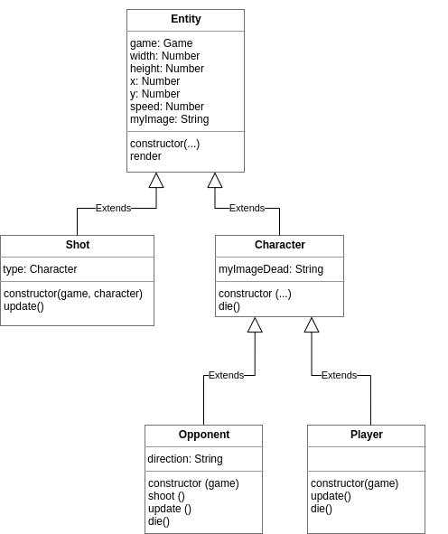

## Practice with Classes, Booleans, Strings, and Event Handling

In this assignment, we are going to develop a complete game using HTML, CSS, and JavaScript. The game is a classic shooting game where we control our character (a square) using the arrow keys or touch screen. The objective of the game is to shoot a series of shapes that will appear on the screen and turn them into stars, while dodging their shots. To start the development, we will use the basic version of the game, for which we provide the code.

## Game elements

The project should be downloaded or cloned onto the computer from which you are working. To do this, you can download the zip package with the code from the attached file.
In this code, we model each of the game elements using a JavaScript class with its methods and attributes, which are described below:

- Entity: Each of the elements drawn in the game
- Character: Each of the characters in the game, meaning those elements that have "life". Inherits from the ENTITY class.
- Player: The main character of the game. Inherits from the CHARACTER class.
- Opponent: The shape that we need to turn into a star. Inherits from the CHARACTER class.
- Shot: A shot from a CHARACTER. Inherits from the ENTITY class.
- Game: The game itself.

In the provided code, all the attributes and methods of these classes are documented in detail. The following diagram shows the class inheritance hierarchy:

## Game start and update

In the index.html file, all the necessary scripts for the game’s functionality are imported, including all the required classes and the main.js file. In this file, a series of constants necessary for the game are defined, an instance of the GAME class is created, and its START method is called to begin the game.

The START method creates the characters, draws the game according to the screen size, and initializes the event listeners (which we will see in the next section). Additionally, this method starts a timer that calls the UPDATE function every 50 ms to update and render the game's current state based on user actions, opponent movements, and the position of the shots. This time interval is equivalent to 20 frames per second, meaning we are updating the game 20 times per second—more than enough to create the illusion of movement.

## Event Handler

To control the main character of the game with the arrow keys or touch screen, we need to use the events provided by the browser for this purpose. In the START method of the GAME class, we initialize the necessary event listeners:

- keydown: Called when the user presses a key. Stores the pressed key in the KEYPRESSED attribute of GAME.
- keyup: Called when the user releases a key. Clears the content of the KEYPRESSED attribute of GAME.
- touchstart: Called when the user touches the screen. Stores the horizontal position (x) where the user touched in the XDOWN attribute of GAME.
- touchmove: Called when the user drags their finger across the screen. Clears the content of the XDOWN attribute of GAME.

As mentioned earlier, every 50 ms the UPDATE method of GAME is called. This method checks the value of XDOWN and KEYPRESSED to update the position of the main character based on the user's actions.

## TASKS

You are required to modify the provided code to implement three new functionalities:

- [TASK 1] Recording the user’s score: Each time an opponent is turned into a star, the score should increase by one point.
- [TASK 2] The main character should have three lives: If hit by a shot, instead of losing immediately, the number of lives will decrease by one, giving the player another chance to win. If the number of lives reaches zero, the game is over.
- [TASK 3] If the player hits the opponent (triangle) and turns it into a star, a more powerful final boss (pentagon) will appear. This boss will move twice as fast as the triangle.

To implement these three features, follow these steps:

- [TASK 1] 
1- Add a new SCORE attribute to the GAME class that reflects the score (initially 0).
2- Modify the code in the COLLIDE method of the OPPONENT class so that it increments SCORE by one each time a triangle is hit by a shot.

- [TASK 2] 
1- Add a new LIVES attribute to the PLAYER class, initially set to 3. You can define the initial number of lives in a constant in main.js.
2- Modify the code in the COLLIDE method of the PLAYER class so that it reduces one life each time the player is hit by a shot while still alive.
If the player has lives remaining, they should "die" for two seconds (by calling the collide method of the CHARACTER superclass) and revive after that time. To do this, the src attribute of this.image should recover its original value (from this.myImage), and this.dead should be set to false.
If the player has no lives left, they should die permanently (by calling the collide method of the CHARACTER superclass), and the game should end by calling the endGame method.

3- Add the necessary code to display the score and lives on the game screen at all times. To do this, create a list (ul HTML tag) with two elements (li tag). The first, with id="scoreli", will display the score in the following format: Score: x, where x is the value of the game's SCORE attribute. The second, with id="livesli", will display the number of lives in the following format: Lives: y, where y is the value of the player's LIVES attribute. To update the HTML with the score and lives values, use the innerHTML method of the corresponding HTML element.

- [TASK 3] 
1- Create a new class called BOSS in a new file named Boss.js (don’t forget to import it in index.html). This class should inherit the necessary methods and attributes from the OPPONENT class, overriding those that are necessary to achieve the required functionality. To represent the final boss, you can use the boss.png and boss_dead.png images from the assets folder.

2- Modify the necessary code in the removeOpponent method of GAME so that when the player manages to defeat the triangle, the final challenge appears. In other words, the opponent attribute of the GAME instance should contain a Boss object when the player defeats the initial opponent.

3- Modify the code in the endGame function (without changing the header) so that, if the player defeats the final boss, meaning they win the game with more than 0 lives, the you_win.png image from the assets folder appears instead of game_over.png.

## RUBRIC

The assignment will be graded by adding the indicated percentage to the total score if the specified part is correct:

- 25%: Correctly displays the user's lives.
- 25%: Correctly displays the user's score.
- 50%: The final opponent functionality is implemented correctly.

